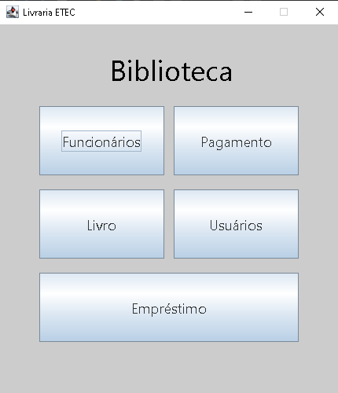

# Livraria ETEC

O **Livraria ETEC** é um sistema desktop desenvolvido em Java com a interface gráfica Swing. O projeto utiliza o gerenciador de dependências Maven e foi projetado para gerenciar as operações principais de uma livraria, permitindo o controle eficiente de funcionários, livros e usuários.

## 🚀 Tecnologias Utilizadas

- **Java JDK 20** (ou superior)
- **Swing** (Interface Gráfica)
- **Maven** (Gerenciamento de dependências e build)
- **MySQL** (Banco de dados relacional)

## 📦 Pré-requisitos

Antes de iniciar, certifique-se de ter instalado em sua máquina:

- Git
- Java JDK (versão 20 ou superior)
- Maven
- MySQL Workbench

## 🛠️ Configuração e Instalação

### 1. Clonar o Repositório

git clone [https://github.com/Victor1669/livraria-etec-java](https://github.com/Victor1669/livraria-etec-java)

cd livraria-etec

### 2. Configurar Variáveis de Ambiente

Antes de rodar a aplicação, você precisa configurar as seguintes variáveis de ambiente no seu sistema para permitir a conexão com o banco de dados:

DB_URL=jdbc:mysql://localhost:3306/`<NOME_BANCO>`

DB_USER=`<NOME_USUARIO>`

DB_PASSWORD=`<SENHA_BANCO>`

### 3. Migrations

Depois de configurar as variáveis de ambiente, é importante criar o banco na sua máquina.

Para executar as migrations, rode em seu terminal (com o maven instalado):

`migrate.bat`

Isso irá executar as migrations do FlyWay
